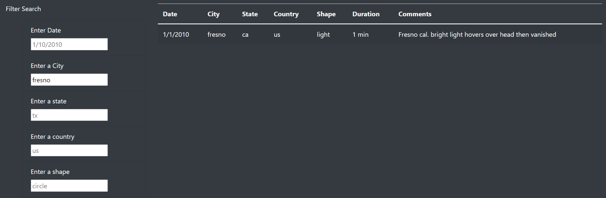
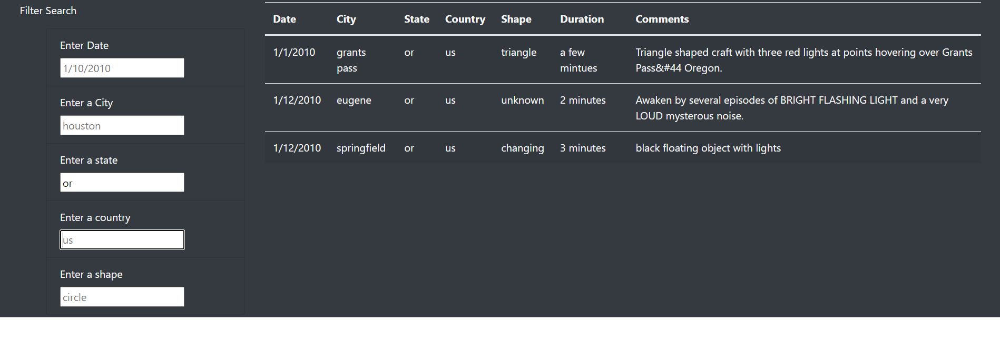

# **The Truth Is Out There!**

## Analysis

Dana would like to add additional search criteria to the webpage already created. Using JavaScript, additional filters were added so that users can do a more specific search by date, city, state, country, and shape. 

## Results

Now that additional filtering has been added to the Filter Search section, searches can be done by city, state, country, and shape.  
 
### City Search
In this example we enter Phoenix in the Enter a City field this brings up any and all reported sightings in Fresno for the set date of 01/10/2010. The table is autopopulated with sightings in Fresno, CA even though the search field for state are set to TX. 

### State Search
When a search is done by state only, for example, Oregon. The table is populated by sightings reported in the state of Oregon, this is for a more broad search as it brings up sightings for all cities in Oregon. 

### Country Search

A search by country can also be done, without setting a specific city or state. For example, we can see in the image below, a search of UFO sightings in the US, brings up multiple cities and state sightings. 

## Summary

Dana's website is a good starting point for someone who is starting their research on UFO sightings or for anyone who has a slight curiousity of sightings in the city and or state they live in; however, there are some drawbacks to the site.

- The comments section provides a brief description of the ufo sighting which is not enough information for anyone wanting to do in depth research on ufo sightings.  

- A button is missing from the search section, this is helpful in letting the user know the site is pulling the information depending on their search criteria. Without the button, if the city and or state they enter does not populate the table, it is unclear if the site stopped working or if there was no information for that particular criteria. 

- The search fields for city and state are case sensitive. This is unnecessary since entering a specific city or state name should pull that information regardless of how it was entered in the search field. 

**Recommendations:**
While Dana's site allows users to do more specific searches with the additional search fields added, there are still some improvements that can be made which will provide more information on UFO sightings.  

- Add a links column to hold newspaper articles that covered the story of the ufo sightings, if it applies. 

- Update the date search field by adding a "From" and "To" so that searches can be done by a date range. 

- Include sightings from the around the world. Currently, the site only pulls sightings for the US. 

With added improvements, Dana can have a dynamic website that will bring in visitors from all over the world..and who knows, maybe even some from out of this world! 

